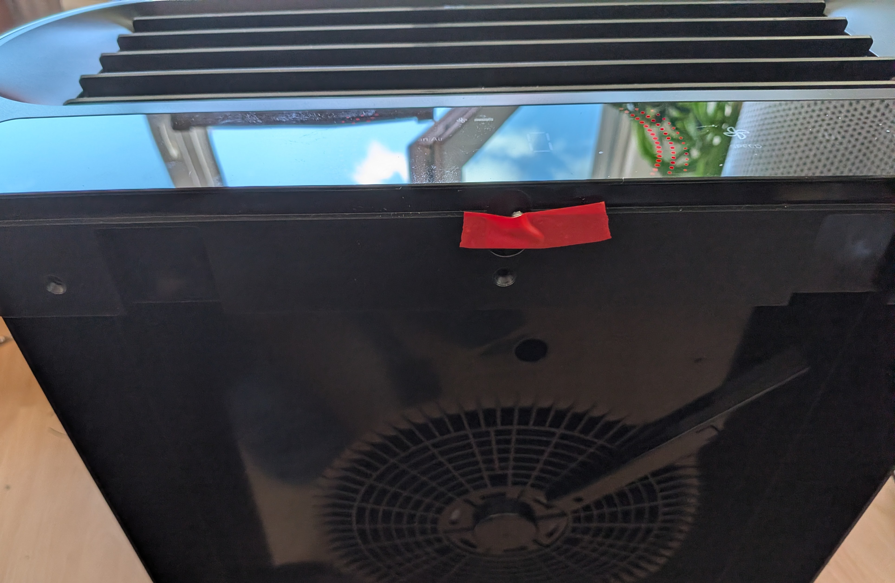
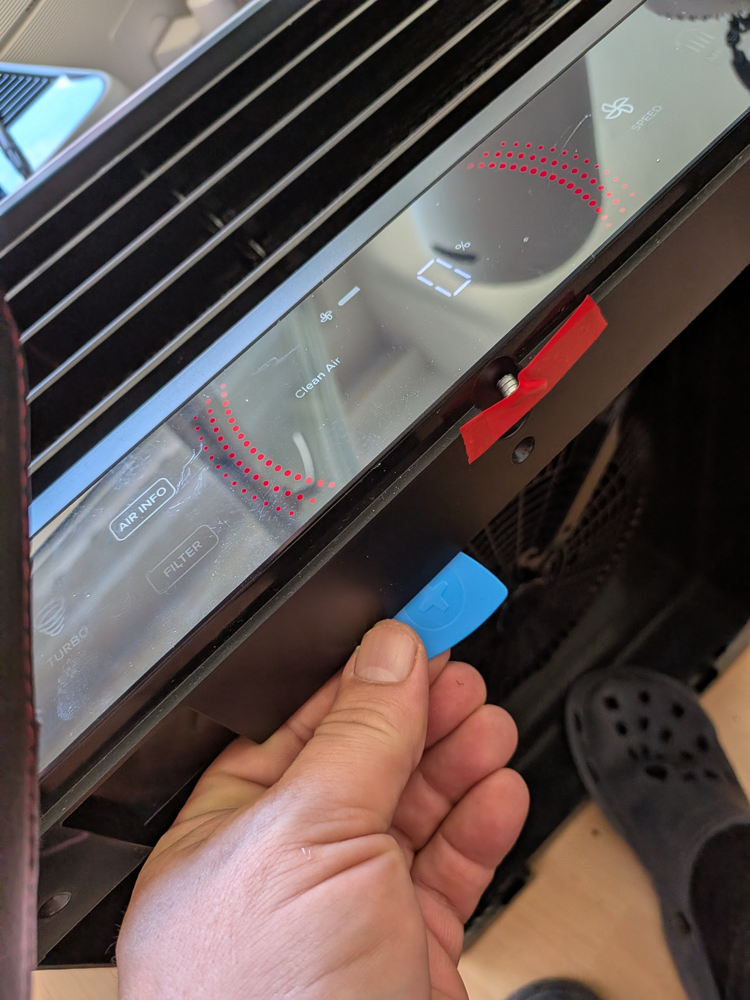
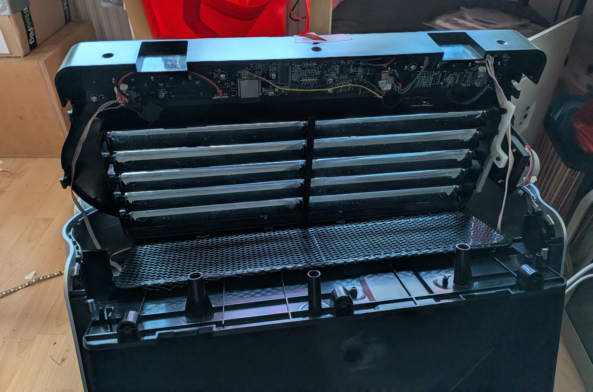
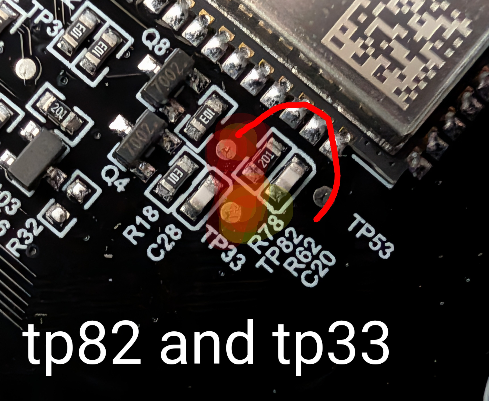
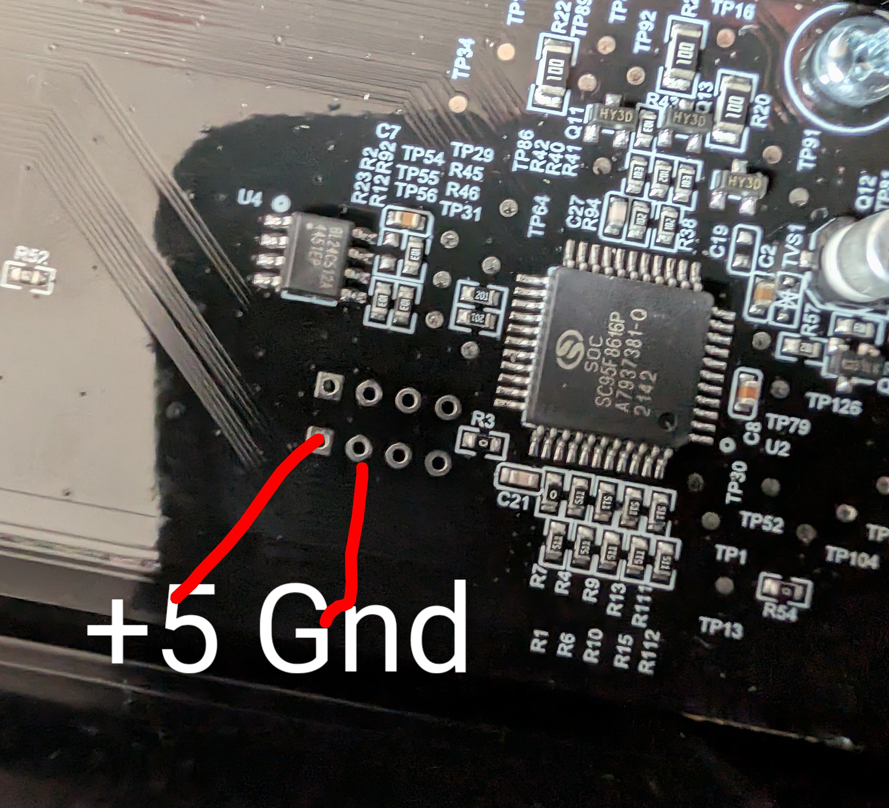
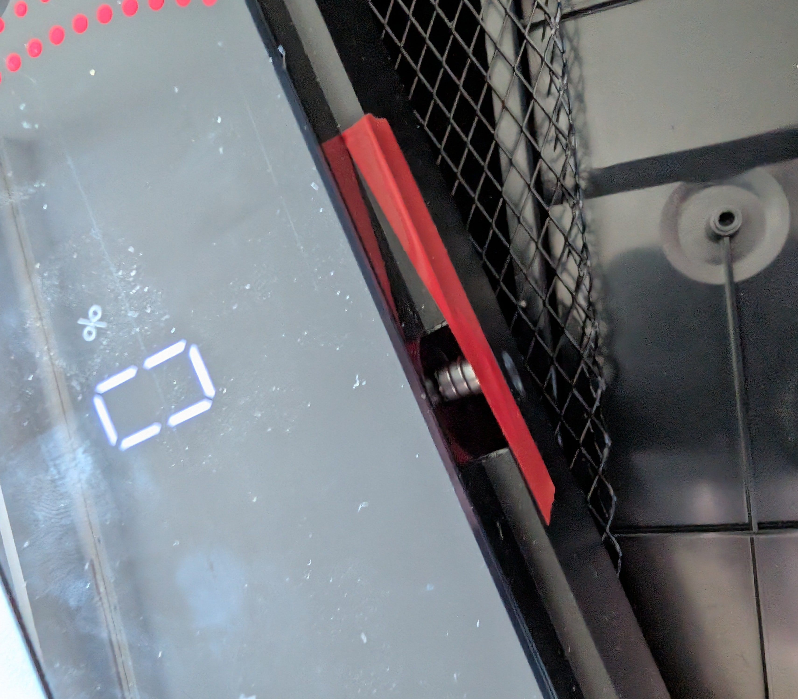

[← Back](../../README.md)

# Levoit Everest Air - Custom Firmware (ESPHome)

## Quick Facts

| Item | Value |
|------|-------|
| Model | Everest Air |
| Tested MCU FW | 1.0.02 |
| ESP Module | ESP32-SOLO-1 |
| Board | xxx |
| Fan Speeds | 3 + Turbo |
| CADR (spec) | 612 m³/h |
| Noise | 24–56 dB |
| Room Size | 9–123 m² (97–1328 ft²) |
| ESPHome | 2026.5.3+ |


## Features

| Feature | Type | Notes |
|---------|------|-------|
| Fan | fan | 3 manual speeds + presets: Manual / Auto / Sleep / Turbo |
| Auto Mode | select | Default / Eco |
| Display | switch | Toggle LED display |
| Child Lock | switch | |
| Light Detect | switch | Auto-dims display when ambient light is low |
| PM1.0 | sensor | µg/m³ (3-channel PM monitor) |
| PM2.5 | sensor | µg/m³ |
| PM10 | sensor | µg/m³ (3-channel PM monitor) |
| AQI | sensor | As reported by MCU |
| Current CADR | sensor | m³/h, updated every 5s |
| Filter Life Left | sensor | % remaining |
| Filter Low | binary_sensor | On when < 5% |
| Filter Lifetime | number | Configurable in months |
| Reset Filter Stats | button | Resets CADR/runtime counters |
| Timer | number | Run timer in minutes |
| MCU Version | text_sensor | |
| Vent Angle | number | EverestAir-specific motorized louver, 45–90° |
| Cover Open | binary_sensor | Back/filter door open — unit powers off while open |

## Protocol Notes

The Everest Air speaks the same **Vital flat-TLV serial protocol** (`CMD=02 00 55`
status, 2-byte ACK). The status frame decodes cleanly against the existing Vital
TLV map (tags `0x00`–`0x17`), so the component reuses `decode_vital_status`. The
device is registered as model `EVERESTAIR`.

The one device-specific feature is the **motorized vent louver**:

| CMD | Direction | Function |
|-----|-----------|----------|
| `02 12 55` | ESP→MCU | Set vent angle: PAY=`01 01 <deg>`, where `<deg>` is `0x2D`–`0x5A` (45–90°) |
| `02 03 55` | ESP→MCU | Set manual fan level 1–3: PAY=`01 01 <1..3>` (also forces FanMode→Manual) |
| `02 02 55` | ESP→MCU | Set fan mode: PAY=`01 01 <m>` — `00`=Manual, `01`=Sleep, `02`=Auto, **`04`=Turbo** (no Pet) |
| `02 02 55` | ESP→MCU | Set Auto Mode: PAY=`02 01 <a> 03 02 00 00` — `00`=Default, `03`=Eco (status tag `0x0F`) |
| `02 05 55` | ESP→MCU | Set filter %: PAY=`02 01 <pct>` (0–100). The ESP computes filter life and pushes it to the MCU's panel indicator |

**Fan speeds:** the unit has 3 manual fan levels (`02 03 55`). The top "Turbo"
step is *not* fan level 4 — it's a distinct fan mode (`02 02 55 = 04`), so it's
exposed as a fan **preset** rather than a 4th speed. When Turbo is active the MCU
reports FanMode=4 and FanLevel=4 in the status frame.

The set angle is echoed back in **status TLV tag `0x14`** on the next `02 00 55`
push. Tag `0x14` reads `0` while the unit is off and defaults to `0x4B` (75°) on
power-up, so the firmware only publishes the angle while it is non-zero.

**Status TLV tag `0x15` = back/cover door sensor:** `0x00` = closed, `0x01` =
open. Opening the back also makes the MCU power the unit off (tag `0x02` Power →
`0`, `0x04` FanLevel → `0xFF`). Exposed as the `cover_open` binary sensor.

### Status TLV reference (Everest Air)

| Tag | Field | Notes |
|-----|-------|-------|
| `0x01` | MCU version | major.minor.patch |
| `0x02` | Power | 0/1 (→0 when cover opened) |
| `0x03` | Fan mode | 0=Manual 1=Sleep 2=Auto 4=Turbo |
| `0x04` | Fan level | 1–4, `0xFF` when off |
| `0x06` | Display | 0/1 |
| `0x09` | AQI level | → AQI sensor |
| `0x0B` | PM2.5 | µg/m³ |
| `0x0C` | PM1.0 | µg/m³ (3-channel monitor) |
| `0x0D` | PM10 | µg/m³ (3-channel monitor) |
| `0x0E` | Child/display lock | 0/1 |
| `0x0F` | Auto mode | 0=Default 3=Eco |
| `0x13` | Light detect | 0/1 |
| `0x14` | Vent angle | 45–90° |
| `0x15` | Cover open | 0=closed 1=open |


## Teardown / Disassembly
Remove 3 black skrews from top



Carefully start to open from the back, pull up with help from some clips



Pull up left and right and remove the top




## Debug Header Pinout

| Pin | Signal |
|-----|--------|
| 1 | EN (reset) |
| 2 | GND |
| 3 | 3.3V |
| 4 | TX |
| 5 | RX |
| 6 | IO0 |

## Connect new ESP32

Make sure to connect EN (reset) to GND on the Debug Header to dissable the old ESP32

Pinout: 





## Flash new ESP32

### Configure

1. Copy `secrets-example.yaml` → `secrets.yaml` and fill in your Wi-Fi and encryption key
2. Adjust the device name in the config if running multiple units
3. Check the [component README](../../components/levoit/README.md) for UART pin mapping per board


### ESPHome Web Builder / Dashboard

Use the pre-generated builder yaml to flash without a local clone — all config is inlined, no `!include` or packages needed:

| File | Board |
|------|-------|
| `levoit-everest-air-builder.yaml` | original ESP32-C3-SOLO-1 |
| `levoit-everest-air-builder-c3.yaml` | ESP32-C3 replacement |
| `levoit-everest-air-builder-s3.yaml` | ESP32-S3 replacement |

Upload to the [ESPHome web builder](https://builder.esphome.io) or paste into the ESPHome dashboard. Regenerate with `.\make-builder-yaml.ps1` from the `devices/` folder.

Or run 
```bash
esphome run levoit-everest-air.yaml
```


## Flash Original ESP32

```bash
esphome run levoit-everest-air.yaml
```

Reassemble and enjoy!

### Prerequisites

Connect to the debug header with a USB-UART adapter (3.3V TTL), crossing TX/RX:
- Adapter TX →  RX
- Adapter RX →  TX

Connect **IO0 to GND before powering on** to enter bootloader mode.

### Backup Existing Firmware

```bash
esptool read_flash 0 ALL levoit-everest-air-backup.bin
```

> Note: may fail if watchdog-protected. Try while powered externally.


### Restore Original Firmware

```bash
esptool erase_flash
esptool write_flash 0x00 levoit-everest-air-backup.bin
```


## Cover Open Sensor

The unit has a cover open sensor, to trick it if you want it running while open use a magnet opt mid like this:

