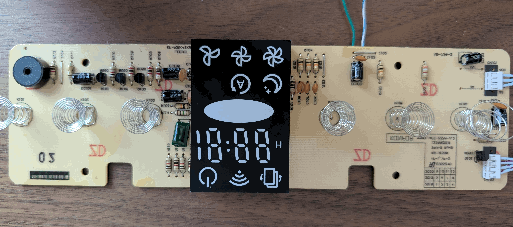
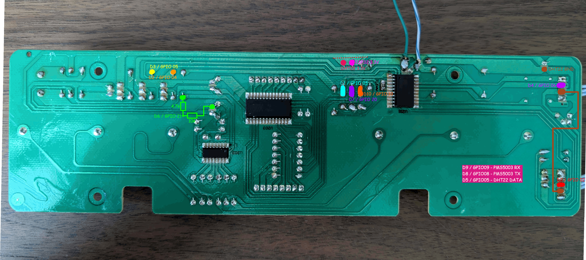

[← Back](../../README.md)

# Levoit LV-PUR131 - Custom Firmware (ESPHome)

The LV-PUR131 model is very similar to the [LV-PUR131S](../levoit-lv131s/README.md) (later called the S board / model) except it doesn't have the wireless capabilities.
They look identical and have mostly the same components.

**Hardware Upgrades:**
- MCU: Original On-Bright OB39R08A3U20SP -> ESP32-C3 Super Mini
- Sensor: Original PM1003 -> PM5003

## Features
- WiFi on a machine that never was supposed to have it!!
- A temperature sensor.
- Everything available on the S model.

## Why this works?
Because we replace the old UC with one that can do wireless and levoit reused the same components between this and the wireless model. 

## Interesting findings
The main differences between the models are the ones related to the microcontroller and the voltage it uses. The S board uses an ESP32 and runs on 3.3V whereas this model runs on a microcontroller that works fully on 5V - even the display is the same, thanks to which this mod is able to use the wifi icon which normally is not (I think?) used by the machine at all. The routing also changes a bit between the boards but not by much.

## Hardware Upgrade Project ("The Hack")
### Required Parts
- Broken or working Levoit LV-PUR131
- Any cheap ESP32 board really. A chinese C3 Super Mini works fine.
- Wires
- 1x 10k ohm resistor
- 1x 4.7k ohm resistor
- PMS5003
- DHT22 (and the things necessary to make it work if your module doesn't have them on board)

### Required Tools
- Something to cut a trace with
- Soldering iron

### Disassembly
Same as the S model.

### Hack / Modify PCB
We need to force the board to behave like the S model so the S mod works here as well. To acomplish this we need to add a voltage divider, cut a trace, and desolder the old UC.

This is what the board looks like:

This is what the mod schematics look like. Only the parts interesting us are laid down, I did not copy the whole board. The mod parts are marked in red:

This is what example solder points look like:

This is what the finished board looks like. Sorry for the flux, I ran out of IPA: 

#### Important?
- The original UC is stuck in place with some kind of glue. You might have to apply a bit of force to get it to move.
- The PMS5003 placement is the same as on the S model, but it does not seem to be the most optimal. I think my module has airflow issues.
- I glued the DHT22 to the outside wall of the space between the air quality sensor and the fan. The temperature readings seem correct, there's only around a .2C difference compared to a sensor I have hanging on a wall which is more than good enough for this kind of sensors. I'll think about getting a more precise one and messing around with the placement as the humidity reading are way off.

### How, why, etc.
The board is designed to work on 5V only. Our ESP32 runs on 3.3V and if we feed it's GPIO 5V it's gonna blow up. Every time there is a risk of 5V going into out new controller we need to somehow convert it to ~3.3V. This is why the voltage divider is needed, and this is also why we need to cut the trace pulling up the TM1628's lines to 5V and replace it with a 3.3V pullup as well.
